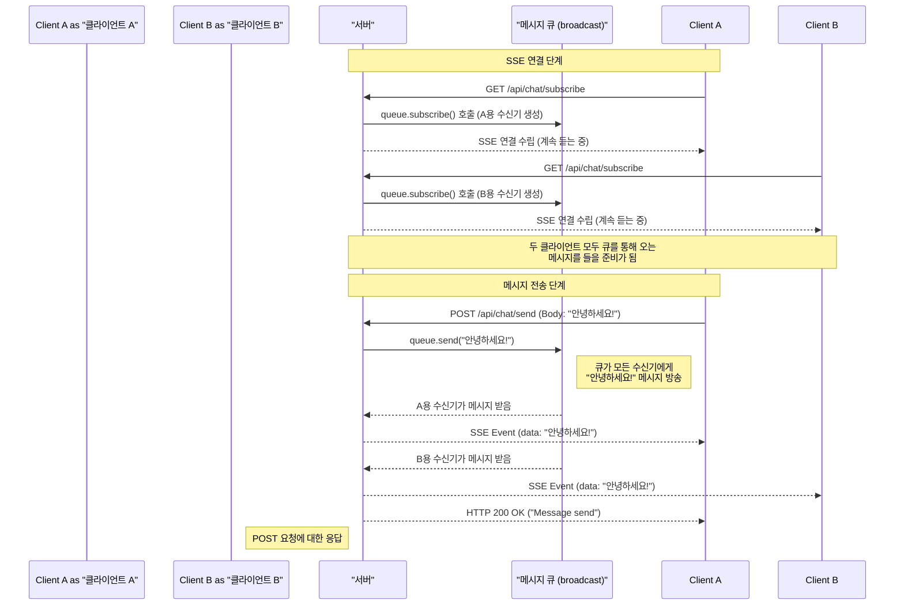

# SSE (Server-Sent Events) 사용법 및 분석

## 1. SSE (Server-Sent Events)란?

SSE는 단어 그대로 **서버가 보내는 이벤트**를 의미합니다. 웹 클라이언트(브라우저)가 서버에 한 번 연결을 맺으면, 그 후로는 **서버가 원할 때마다 일방적으로 클라이언트에게 데이터를 푸시(push)할 수 있는 기술**입니다.

전통적인 웹에서는 클라이언트가 무언가 필요할 때마다 서버에 요청(request)을 보내야만 응답(response)을 받을 수 있었습니다. 실시간 데이터가 필요하면 클라이언트는 주기적으로 서버에 "새로운 데이터 있나요?"라고 물어봐야 했죠 (이를 '폴링'이라고 합니다).

SSE는 이런 비효율을 해결합니다. 한 번의 HTTP 연결을 계속 열어두고, 서버 쪽에서 새로운 이벤트가 발생할 때마다 그 연결을 통해 클라이언트로 데이터를 흘려보내 줍니다.

## 2. SSE의 구조와 특징

*   **단방향 통신 (Server -> Client)**: SSE의 가장 큰 특징은 서버에서 클라이언트로의 단방향 통신이라는 점입니다. 클라이언트는 데이터를 받기만 합니다. (만약 양방향 통신이 필요하다면 WebSocket이 더 적합합니다.)
*   **표준 HTTP 기반**: 별도의 프로토콜이 아닌 일반적인 HTTP 프로토콜을 사용합니다. 따라서 기존 웹 서버 인프라와 잘 호환됩니다.
*   **자동 재연결**: 네트워크 문제 등으로 연결이 끊어지면, 클라이언트(브라우저의 `EventSource` API)가 자동으로 서버에 재연결을 시도하는 표준 기능이 내장되어 있습니다.
*   **이벤트 기반**: 서버는 데이터와 함께 '이벤트 타입'을 지정해서 보낼 수 있습니다. 클라이언트는 특정 타입의 이벤트만 골라서 처리할 수 있습니다.

## 3. SSE 사용 방법

### 클라이언트 측 (React.js)

클라이언트는 React 컴포넌트 내에서 `useEffect` 훅을 사용하여 `EventSource` 객체를 생성하고 관리합니다.

```jsx
import React, { useState, useEffect } from 'react';

const ChatComponent = () => {
    const [messages, setMessages] = useState([]);
    const [newMessage, setNewMessage] = useState('');

    useEffect(() => {
        // 1. 서버의 SSE 엔드포인트로 EventSource 객체 생성
        const sse = new EventSource('/api/chat/subscribe');

        // 2. 'message' 타입의 이벤트가 수신될 때마다 실행
        sse.addEventListener('message', (event) => {
            // event.data는 서버가 보낸 데이터입니다.
            // 서버에서 `json!(...)`으로 감쌌기 때문에 JSON 파싱이 필요합니다.
            const parsedData = JSON.parse(event.data);
            setMessages(prevMessages => [...prevMessages, parsedData]);
        });

        // 3. 연결이 열렸을 때
        sse.onopen = () => {
            console.log("SSE 연결이 열렸습니다.");
        };

        // 4. 에러 처리
        sse.onerror = (error) => {
            console.error("SSE 에러 발생:", error);
            // 필요에 따라 여기서 재연결 로직을 구현할 수도 있습니다.
            sse.close();
        };

        // 5. 컴포넌트가 언마운트될 때 SSE 연결을 정리합니다.
        return () => {
            console.log("SSE 연결을 닫습니다.");
            sse.close();
        };
    }, []); // 빈 의존성 배열은 이 effect가 컴포넌트 마운트 시 한 번만 실행되도록 합니다.

    // 서버로 메시지를 전송하는 함수
    const sendMessage = async (e) => {
        e.preventDefault();
        if (!newMessage.trim()) return;

        try {
            await fetch('/api/chat/send', {
                method: 'POST',
                headers: {
                    // 서버의 send 함수가 String 타입으로 받으므로 `text/plain`을 사용합니다.
                    'Content-Type': 'text/plain',
                },
                body: newMessage,
            });
            setNewMessage(''); // 메시지 전송 후 입력 필드 초기화
        } catch (error) {
            console.error('메시지 전송 실패:', error);
        }
    };

    return (
        <div>
            <h1>React SSE Chat</h1>
            <div id="chat-box" style={{ border: '1px solid #ccc', padding: '10px', height: '300px', overflowY: 'scroll' }}>
                {messages.map((msg, index) => (
                    <div key={index}>{msg}</div>
                ))}
            </div>
            <form onSubmit={sendMessage}>
                <input
                    type="text"
                    value={newMessage}
                    onChange={(e) => setNewMessage(e.target.value)}
                    placeholder="메시지를 입력하세요..."
                    style={{ width: '80%', padding: '5px' }}
                />
                <button type="submit">전송</button>
            </form>
        </div>
    );
};

export default ChatComponent;
```

### 서버 측

서버는 클라이언트의 요청에 대해 아래 두 가지 규칙을 지켜 응답해야 합니다.

1.  `Content-Type` 헤더를 `text/event-stream` 으로 설정합니다.
2.  메시지 본문을 `data: <메시지 내용>\n\n` 형식으로 보냅니다. (`\n\n` 즉, 빈 줄 하나가 메시지의 끝을 의미합니다.)

```http
HTTP/1.1 200 OK
Content-Type: text/event-stream
Connection: keep-alive
Cache-Control: no-cache

event: message
data: {"user":"alice","text":"안녕하세요!"}

event: message
data: {"user":"bob","text":"반갑습니다."}

: this is a comment and will be ignored by the client

```

## 4. 코드 분석 (`subscribe` & `send` 함수)

### `subscribe` 함수

이 함수는 Axum 프레임워크를 사용하여 SSE 서버 엔드포인트를 구현한 것입니다. 클라이언트가 SSE 연결을 요청하는 핸들러입니다.

```rust
// src/api/chat.rs
pub async fn subscribe(
    State(queue): State<broadcast::Sender<String>>,
) -> impl IntoResponse {
    let stream = BroadcastStream::new(queue.subscribe())
        .map(|msg| match msg {
            Ok(msg) => Ok(Event::default()
                .event("message")
                .data(json!(msg).to_string())),
            Err(e) => Err(e),
        });

    Sse::new(stream)
        .keep_alive(
            KeepAlive::new()
                .interval(Duration::from_secs(10))
                .text("keep-alive-text"),
        )
        .into_response()
}
```

**흐름 요약:**
1.  클라이언트가 `/api/chat/subscribe` 엔드포인트에 접속합니다.
2.  `subscribe` 함수는 공유 메시지 큐(`queue`)로부터 이 클라이언트만을 위한 수신기(`Receiver`)를 만듭니다.
3.  이 `Receiver`는 비동기 `stream`으로 변환됩니다.
4.  `Sse::new(stream)`를 통해 Axum은 이 스트림을 계속 주시합니다.
5.  다른 곳에서 `queue`에 메시지를 보내면, 이 `stream`이 메시지를 받고 SSE `Event` 형식으로 변환하여 클라이언트에게 전송(push)합니다.

### `send` 함수

이 함수는 클라이언트가 새 메시지를 '보내기' 위해 호출하는 핸들러입니다.

```rust
// src/api/chat.rs
pub async fn send(
    State(queue): State<broadcast::Sender<String>>,
    new_message: String,
) -> &'static str {
    queue.send(new_message).expect("Error sending message");
    "Message send"
}
```

### `subscribe`와 `send`의 상호작용

`subscribe`와 `send`는 `tokio::sync::broadcast` 채널을 통해 상호작용합니다.

1.  **연결 수립**: 여러 클라이언트가 `/api/chat/subscribe`에 접속하여 각자의 "수신기(`Receiver`)"를 갖게 됩니다.
2.  **메시지 전송**: 한 클라이언트가 `/api/chat/send`로 메시지를 보냅니다.
3.  **메시지 방송**: `send` 함수는 받은 메시지를 `broadcast` 채널의 "발신자(`Sender`)"를 통해 방송합니다.
4.  **메시지 수신 및 푸시**: 채널을 구독하고 있던 **모든** 수신기들(`subscribe` 핸들러들)이 메시지를 받아 각자의 클라이언트에게 SSE로 푸시합니다.

이 구조를 통해 하나의 메시지 전송(`send`)이 접속해있는 모든 클라이언트(`subscribe` 연결들)에게 실시간으로 전파되는 채팅 기능이 구현됩니다.

