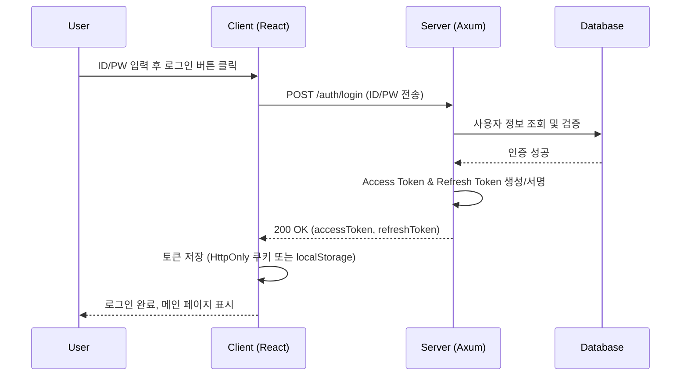
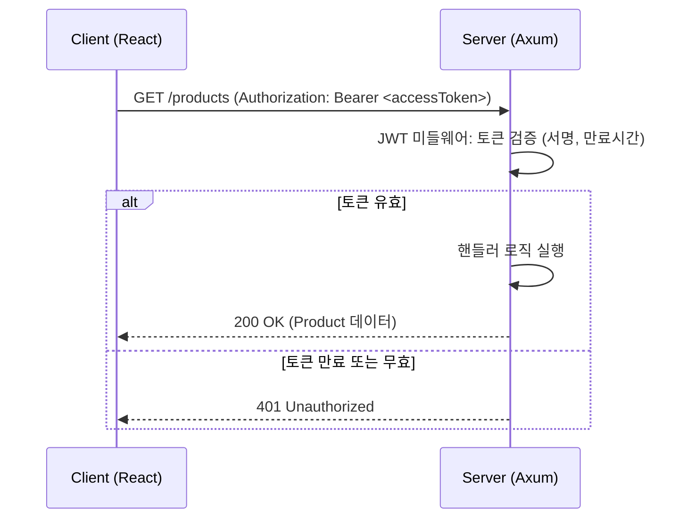
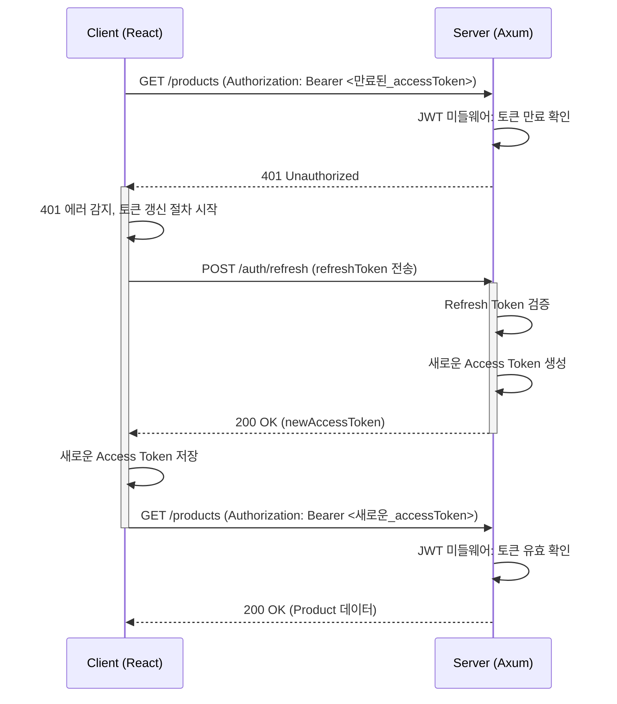

# JWT Access/Refresh Token 인증 완전 정복 가이드

## 목차
1. [핵심 개념: Access Token vs Refresh Token](#1-핵심-개념-access-token-vs-refresh-token)
2. [서버(Rust/Axum)의 역할](#2-서버rustaxum의-역할-무엇을-발급하고-무엇을-저장하는가)
3. [클라이언트(React)의 역할](#3-클라이언트react의-역할-무엇을-저장하고-어떻게-사용하는가)
4. [인증 전체 흐름 (Sequence Diagrams)](#4-인증-전체-흐름-sequence-diagrams)
    - [최초 로그인](#41-최초-로그인)
    - [보호된 API 접근](#42-보호된-api-접근-access-token-유효-시)
    - [Access Token 갱신](#43-access-token-갱신-만료-시)

---

## 1. 핵심 개념: Access Token vs Refresh Token

먼저 두 종류의 토큰이 왜 필요한지, 각자의 역할은 무엇인지 이해하는 것이 중요합니다.

| 구분 | Access Token (액세스 토큰) | Refresh Token (리프레시 토큰) |
| :--- | :--- | :--- |
| **목적** | API 리소스 접근 권한 증명 | 새로운 액세스 토큰 발급 |
| **수명** | **짧음** (예: 15분 ~ 1시간) | **김** (예: 7일 ~ 30일) |
| **보안** | 수명이 짧아 탈취되어도 피해가 제한적 | 수명이 길어 매우 안전하게 보관해야 함 |
| **사용 빈도** | API를 호출할 때마다 사용 | 액세스 토큰이 만료되었을 때만 사용 |

---

## 2. 서버(Rust/Axum)의 역할: 무엇을 발급하고, 무엇을 저장하는가?

**1. 서버가 발급하는 것:**

*   **Access Token:** 사용자가 로그인에 성공하면, 서버는 사용자의 정보(ID, 역할 등)와 만료 시간을 담은 Access Token을 생성하고, **비밀 키(Secret Key)**로 서명하여 발급합니다.
*   **Refresh Token:** Access Token과 함께, 더 긴 만료 시간을 가진 Refresh Token을 생성하고 서명하여 발급합니다.

**2. 서버가 저장하는 것 (매우 중요!):**

*   **JWT 비밀 키 (JWT Secret Key):** `.env` 파일 등 안전한 곳에 보관합니다. 이 키는 토큰의 서명을 생성하고 검증하는 데 사용되며, **절대 외부에 노출되어서는 안 됩니다.**
*   **사용자 정보:** 데이터베이스에 저장된 사용자의 ID, 암호화된 비밀번호 등
*   **(선택 사항) Refresh Token 데이터:** 더 높은 보안 수준을 위해, 발급한 Refresh Token의 일부 정보(또는 전체)를 데이터베이스나 Redis에 저장할 수 있습니다. 이는 특정 사용자를 강제로 로그아웃시키거나(토큰을 DB에서 삭제), 토큰 탈취가 의심될 때 해당 토큰을 무효화하는 데 사용됩니다. 하지만 이는 JWT의 'Stateless'라는 장점을 일부 희생하는 것입니다.

> **핵심:** 서버는 기본적으로 **Access/Refresh Token 자체를 저장하지 않습니다.** 이것이 JWT의 **Stateless(무상태성)** 특징입니다. 서버는 클라이언트가 보낸 토큰의 서명을 자신의 비밀 키로 검증함으로써 토큰의 유효성을 판단합니다.

---

## 3. 클라이언트(React)의 역할: 무엇을 저장하고, 어떻게 사용하는가?

*   **토큰 저장:** 서버로부터 받은 Access Token과 Refresh Token을 안전한 곳에 저장해야 합니다.
    *   **HttpOnly Cookies (추천):** JavaScript로 접근이 불가능하여 XSS(Cross-Site Scripting) 공격에 안전합니다. 서버에서 `Set-Cookie` 헤더로 설정해 주어야 하며, CSRF(Cross-Site Request Forgery) 공격에 대한 방어(예: SameSite 속성 설정)가 필요합니다.
    *   **localStorage:** 사용하기 간편하지만, JavaScript로 접근이 가능하여 XSS 공격에 취약할 수 있습니다.
*   **API 요청:** 보호된 API를 호출할 때마다 HTTP `Authorization` 헤더에 Access Token을 실어 보냅니다. (`Authorization: Bearer <accessToken>`)
*   **토큰 갱신:** API 요청이 401 Unauthorized(토큰 만료) 에러로 실패하면, 저장해 둔 Refresh Token을 사용하여 서버에 새로운 Access Token을 요청합니다.

---

## 4. 인증 전체 흐름 (Sequence Diagrams)

시간 순서에 따라 클라이언트와 서버가 어떻게 상호작용하는지 단계별로 설명하겠습니다.

### 4.1 최초 로그인

> 클라이언트가 ID/PW로 서버에 자신을 증명하고, 앞으로 사용할 통행증(토큰)을 발급받는 과정입니다.

### 4.2 보호된 API 접근 (Access Token 유효 시)

> 클라이언트가 발급받은 통행증(Access Token)을 이용해 서버의 자원을 사용하는 과정입니다.

### 4.3 Access Token 갱신 (만료 시)

> 통행증(Access Token)의 유효기간이 다 되어, 더 긴 유효기간을 가진 증표(Refresh Token)로 새 통행증을 재발급받는 과정입니다.

1.  **Client → Server:** 만료된 Access Token과 함께 API 요청을 보냅니다.
2.  **Server (JWT Middleware):** 토큰 만료를 확인하고 `401 Unauthorized` 에러를 반환합니다.
3.  **Client (API Interceptor):** `401` 에러를 감지하고, 원래 요청은 잠시 보류한 뒤 토큰 갱신 절차를 시작합니다.
4.  **Client → Server:** 저장해 둔 **Refresh Token**으로 토큰 갱신을 요청합니다.
5.  **Server:** Refresh Token을 검증하고, 유효하다면 **새로운 Access Token**을 발급합니다.
6.  **Server → Client:** 새로운 Access Token을 응답으로 보냅니다.
7.  **Client:** 새로 받은 Access Token을 저장하고, 보류했던 원래 API 요청을 **새로운 Access Token**과 함께 다시 보냅니다.
8.  **Server:** 유효한 토큰을 확인하고 정상적으로 처리하여 응답합니다.

이러한 흐름을 통해, 보안(짧은 수명의 Access Token)과 사용자 편의성(긴 수명의 Refresh Token 덕분에 로그인을 자주 할 필요 없음)을 모두 만족시키는 견고한 인증 시스템을 구축할 수 있습니다.